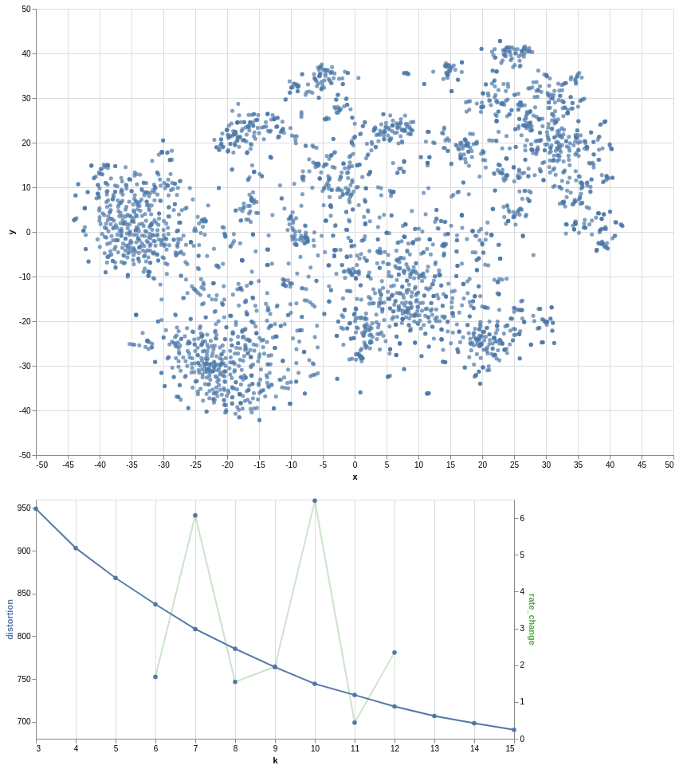
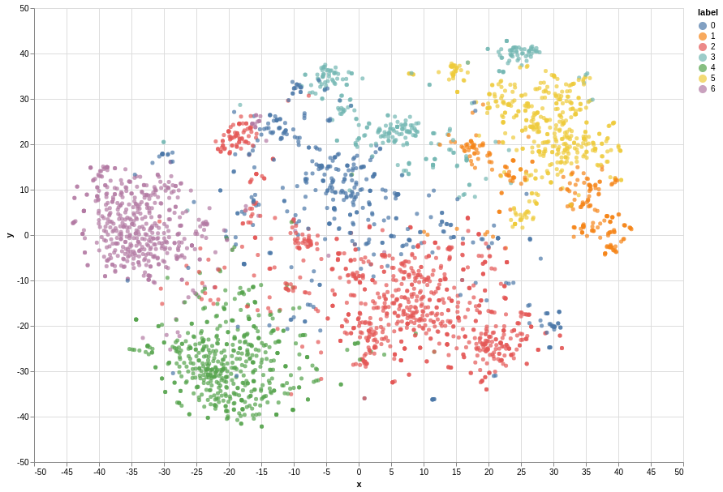
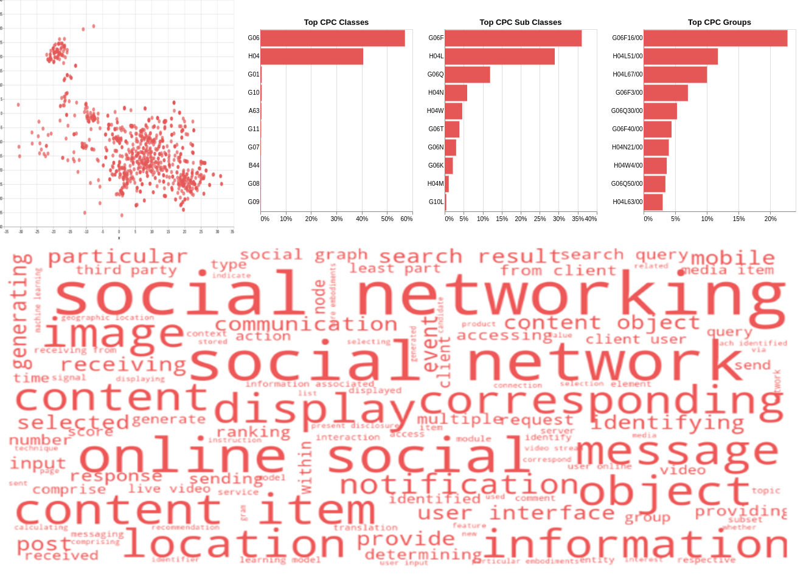
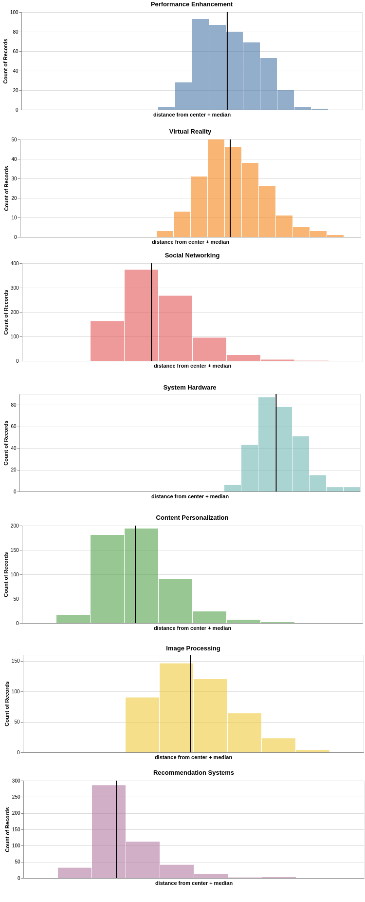
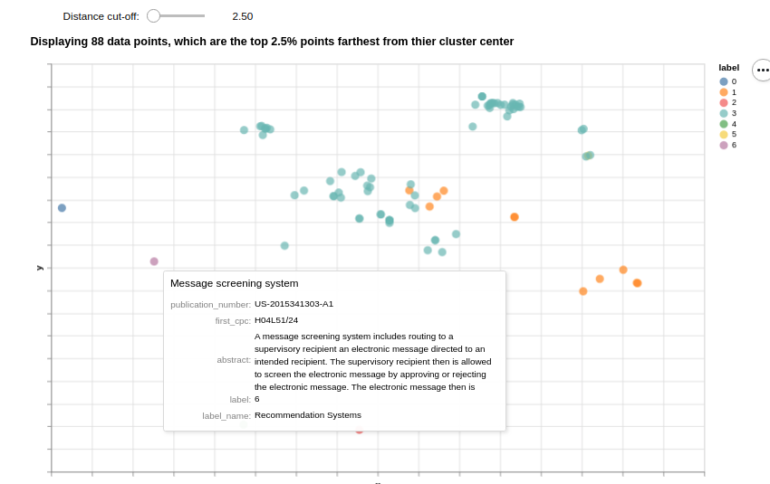
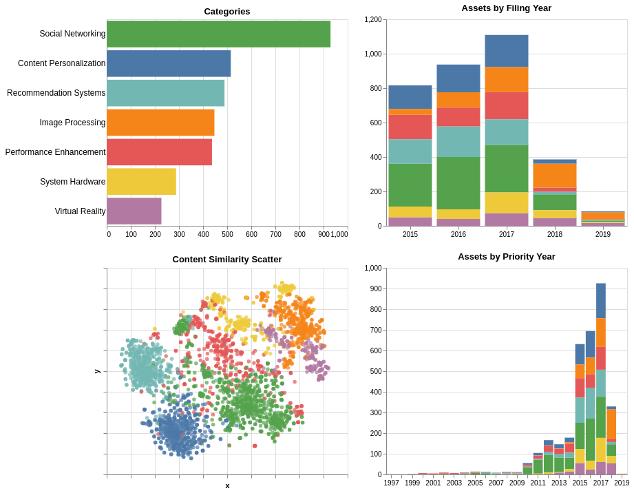
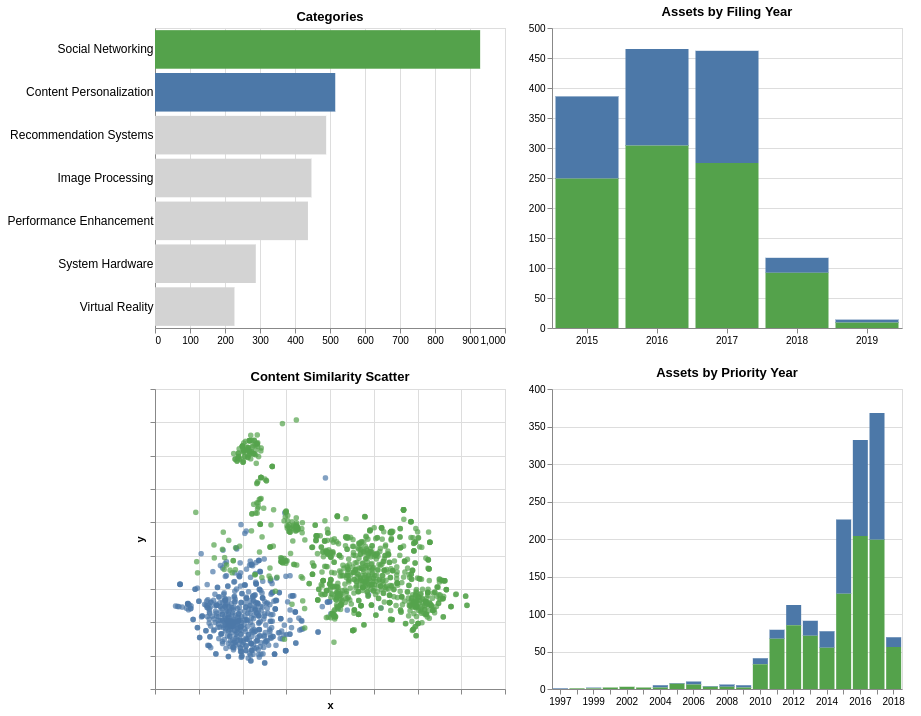
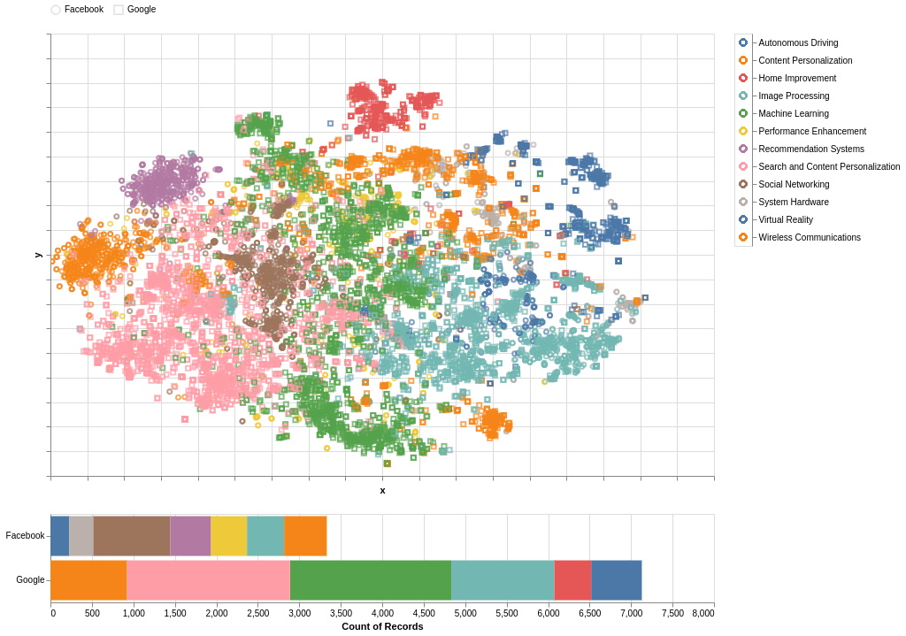
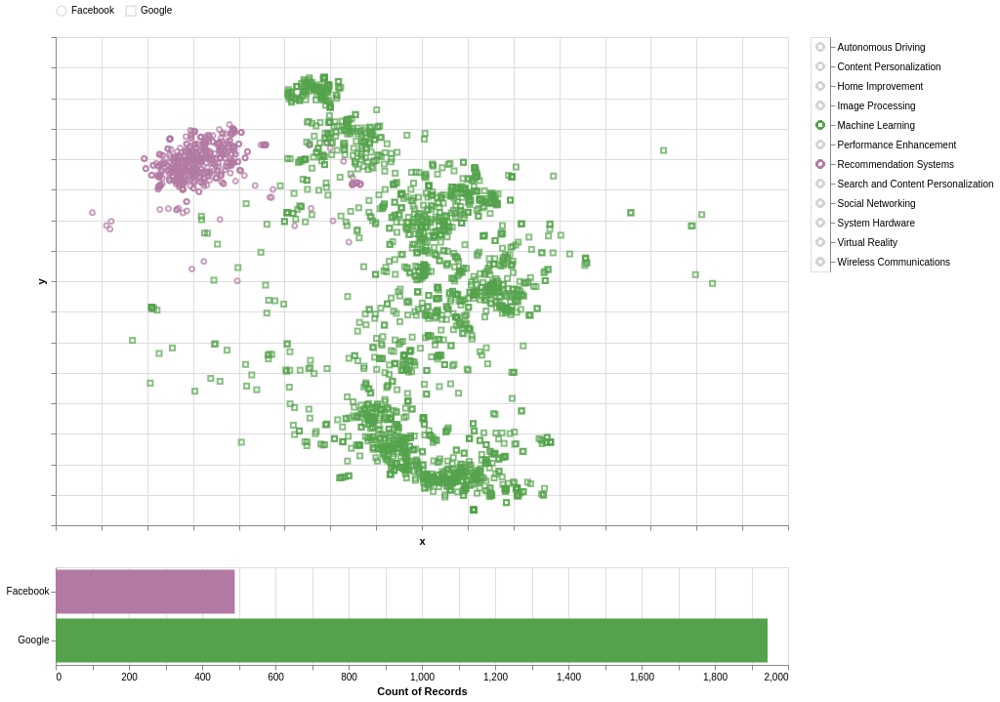

# Patent_Clustering_Public
Categorizing patents using NLP. This is the public version of Patent_Clustering repository. if you need access to code or have any questions please reach out to the <a href="#head4">author</a>
 
 ## Table of Contents
 <ol>
   <li><a href="#head1"> Motivation of the project </a>
   <li><a href="#head2"> Five Step Portfolio Categorization Process </a>
   <li><a href="#head3"> Acknowledgements </a>
   <li><a href="#head4"> Author </a>
</ol>

<h2 id="head1"> Motivation of the project</h2>

I have been working in the Intellectual Property domain for 12 years now. One of the common tasks that has to be performed in the domain is patent portfolio evaluation. First step towards evaluating a patent portfolio is to categorize the patents into various buckets, then perform analytics on the categorized portfolio. The process can take anywhere between a week to a month depending on portfolio and team size. I believe, utilizing my knowledge gained in the Data Science nanodegree, I can substantially reduce the effort by 60 - 70% and also increase the quality of a patent categorization process.

<h2 id="head2"> Five Step Portfolio Categorization Process </h2>

### Step 1: Visualize Portfolio
Facebook potfolio visualized in 3-dimension. The chart below helps in determining the number of clusters to form.

### Step 2: Categorize Portfolio
Facebook potfolio categorized in 7 clusters.

Further, details on one of the cluster.

### Step 3: Review Portfolio
Distribution of distances from cluster centers in Facebook portfolio categorization, to help in review quality of clusters.

Facebook clusters with a slider to select only farther data point from cluster center for review.

### Step 4: Basic Analysis
Basic Analysis of Facebook portfolio.

### Step 5: Advanced Analysis
Advanced Analysis of Facebook portfolio compared with Google portfolio.

<h2 id="head3"> Acknowledgements </h2>

<ul>
 <li> Udacity https://www.udacity.com/
 <li> Google Patents https://patents.google.com/
 <li> Google Patents Research Data https://console.cloud.google.com/marketplace/details/google_patents_public_datasets/google-patents-research-data
 <li> PatentsView https://www.patentsview.org/download/
 <li> Reed Tech http://patents.reedtech.com/patent-products.php 
</ul>

<h2 id="head4"> Author </h2>

Shahzeb Akhtar

https://www.linkedin.com/in/shahzebakhtar/
